# Booking Request Flow - Visual Diagrams

This document contains visual diagrams of the booking request flow using Mermaid syntax. These diagrams can be rendered in GitHub, Markdown viewers, or at [mermaid.live](https://mermaid.live).

## 1. Complete Booking Flow Sequence Diagram

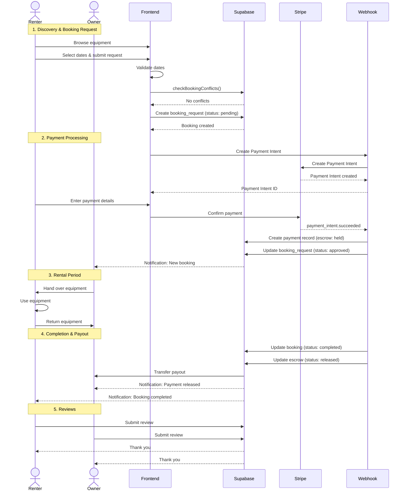

## 2. State Machine Diagram

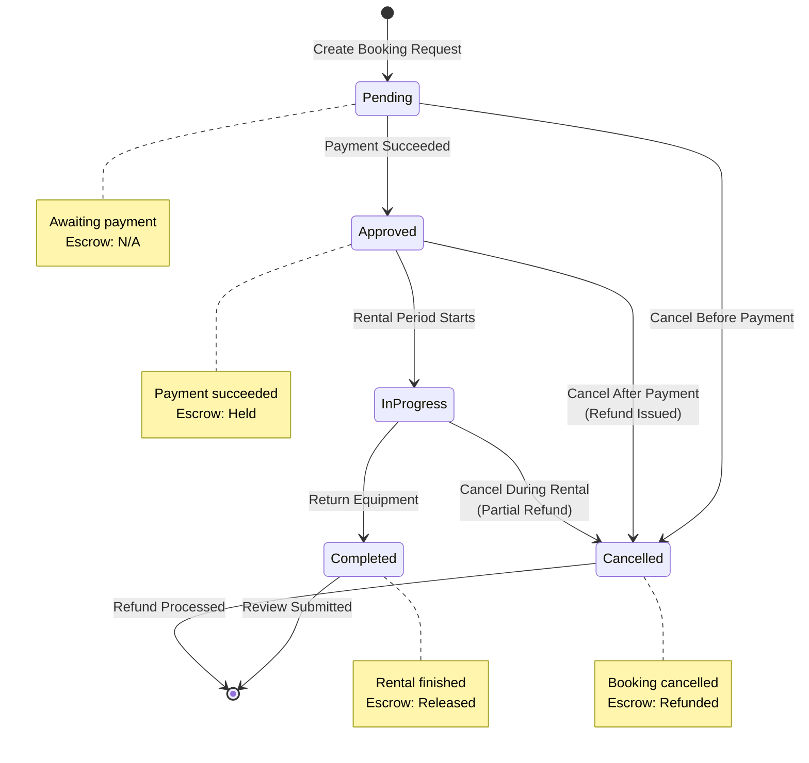

## 3. Component Architecture

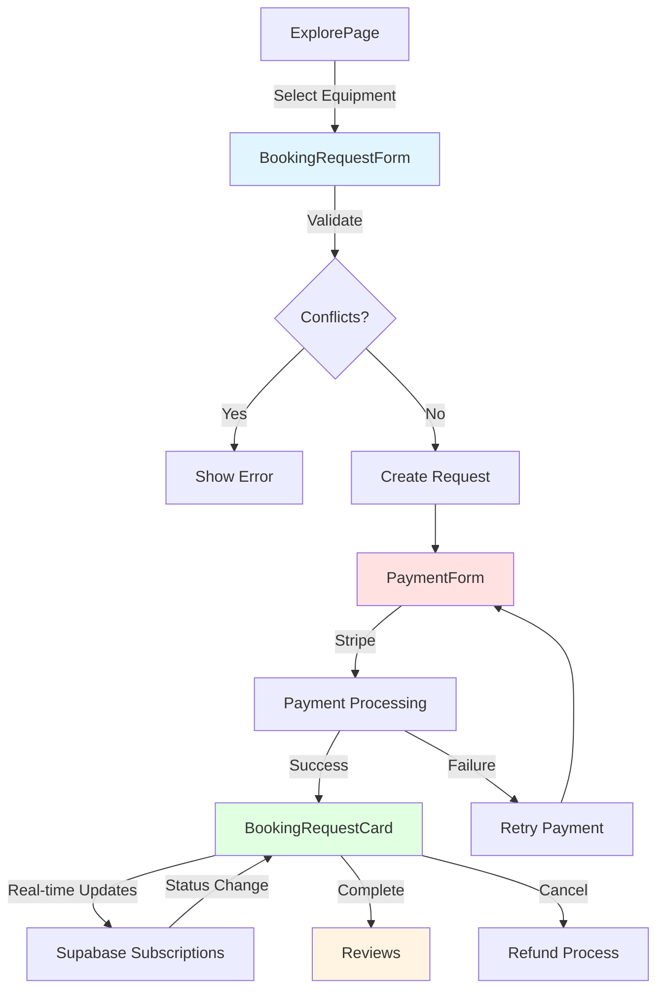

## 4. Database Entity Relationship

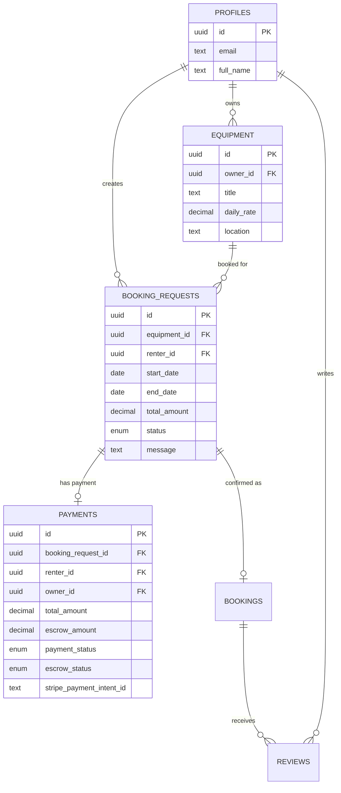

## 5. Payment Flow Detail

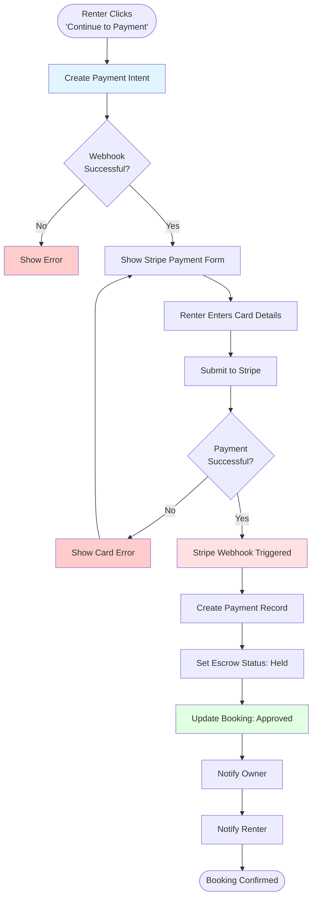

## 6. Conflict Detection Flow

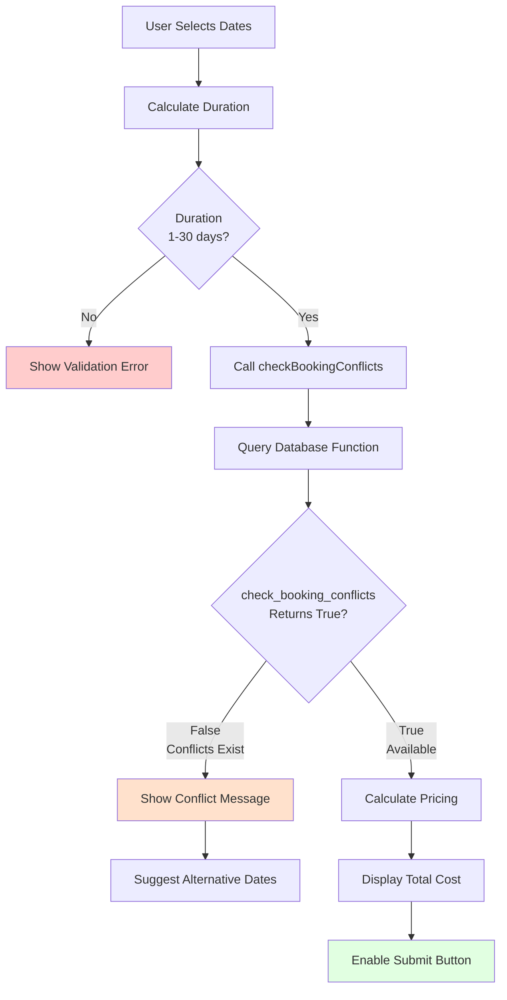

## 7. Escrow Management Flow

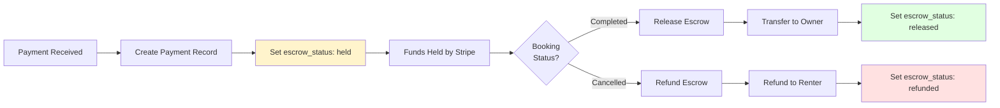

## 8. User Journey Map

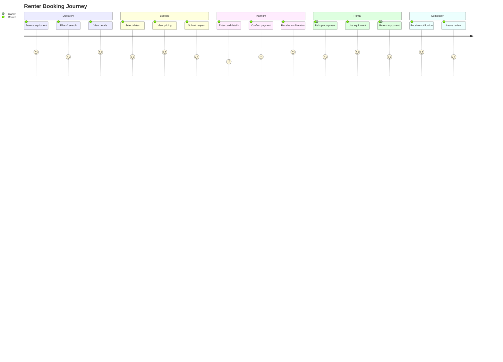

## 9. System Context Diagram

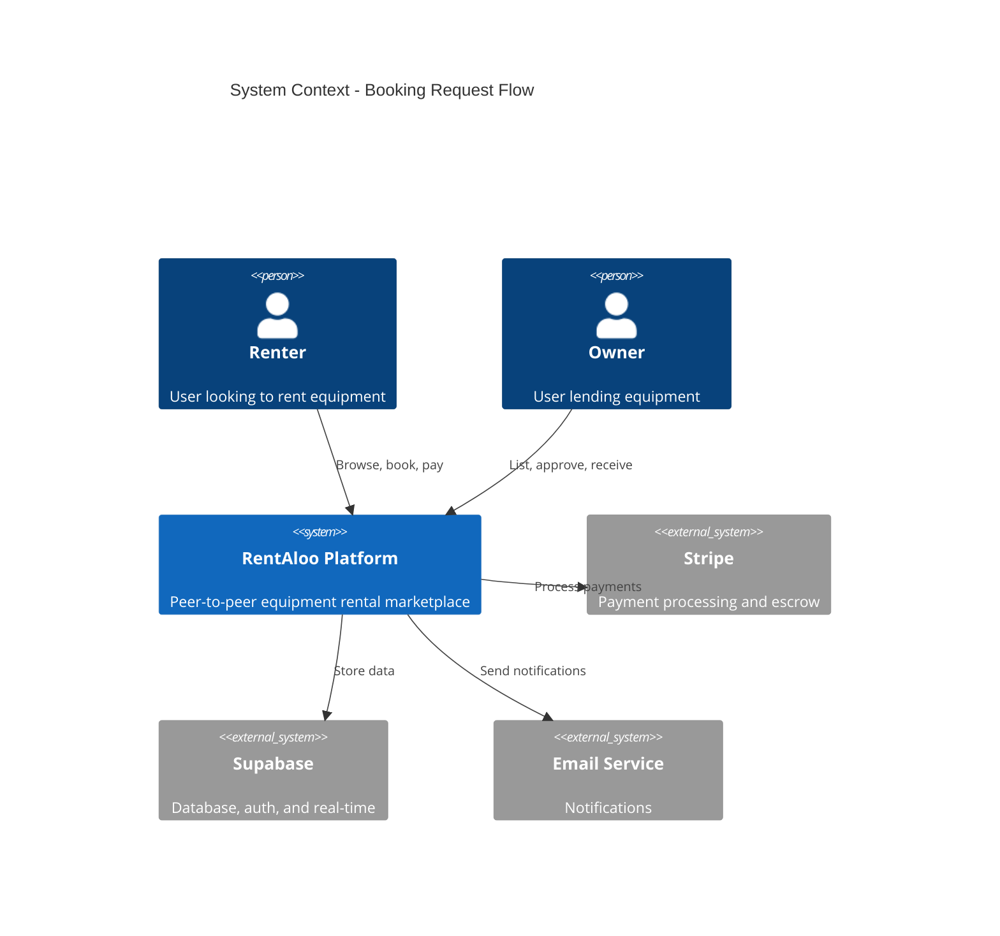

## 10. Real-time Updates Flow

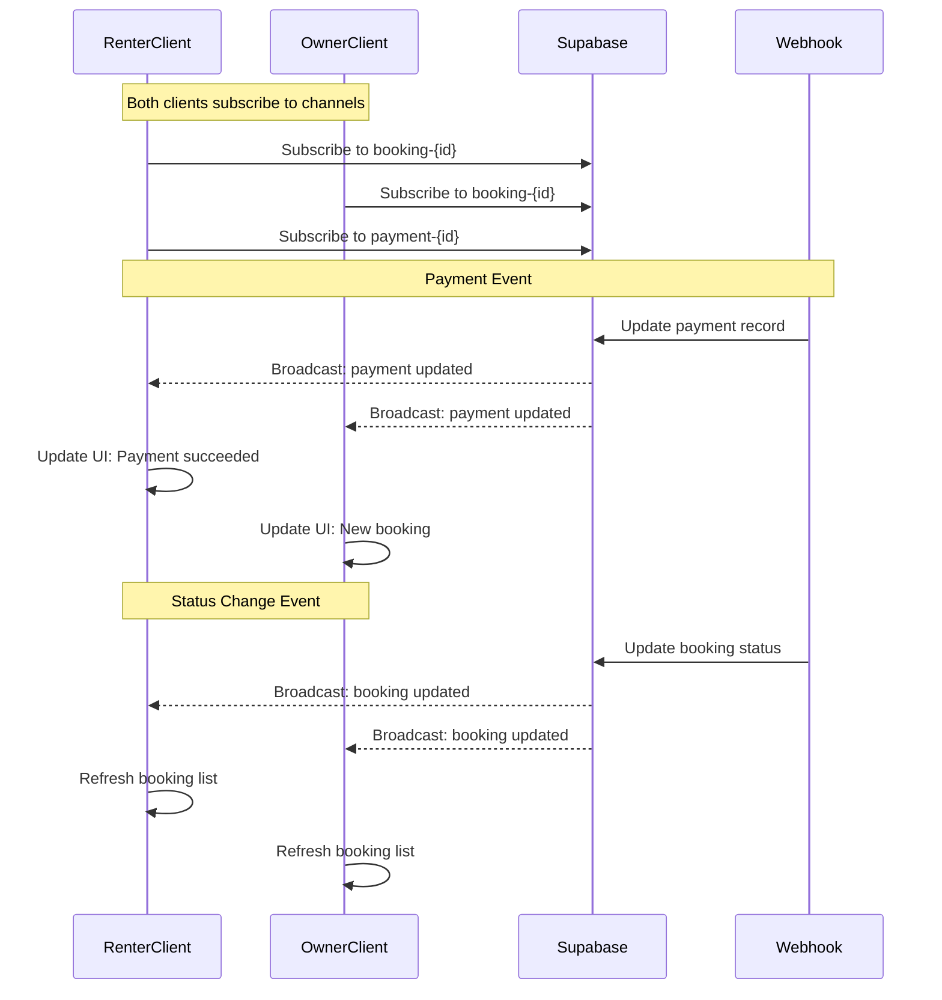

## 11. Cancellation Flow

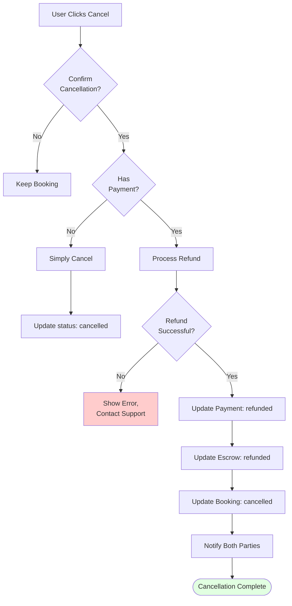

## Rendering These Diagrams

### GitHub/GitLab
These diagrams will automatically render in GitHub or GitLab markdown files.

### VS Code
Install the "Markdown Preview Mermaid Support" extension to view diagrams.

### Online
Copy any diagram code block and paste it at [mermaid.live](https://mermaid.live) for interactive viewing and editing.

### Export
From mermaid.live, you can export diagrams as:
- PNG image
- SVG vector
- PDF document

## Diagram Legend

### Colors
- 🔵 Blue: User actions and inputs
- 🔴 Red: Payment/financial operations  
- 🟢 Green: Successful states/completions
- 🟡 Yellow: Intermediate/processing states
- ⚪ Gray: System/automated operations
- ❌ Red Fill: Errors and failures

### Shapes
- Rectangle: Process or action
- Diamond: Decision point
- Rounded: Start/end points
- Parallelogram: Data input/output
- Cylinder: Database operations
